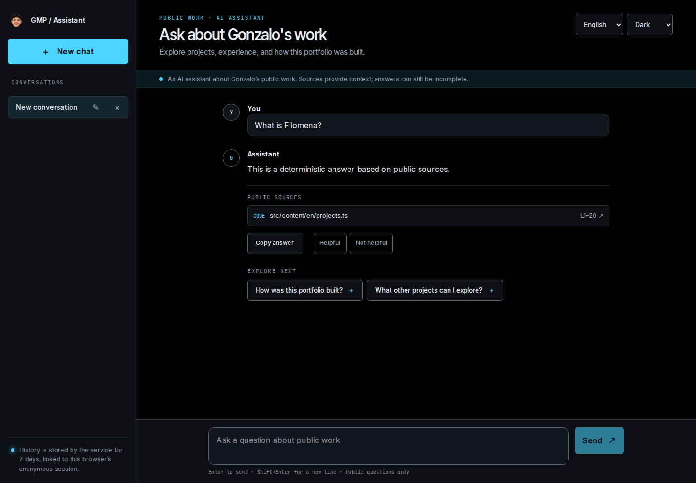
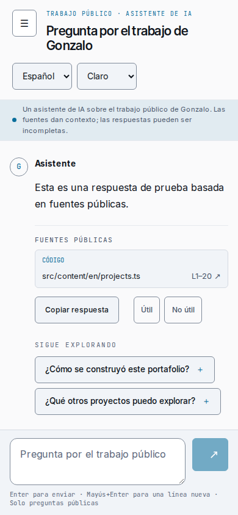

# Portfolio assistant web

A bilingual Next.js assistant about Gonzalo's public professional work. It calls a pinned
API directly and contains no provider credentials. AI output is untrusted and may be
incomplete even when sources are included.

## Actual interface

These screenshots show the implemented interface using deterministic fixture answers,
not live model output or personal conversations.





[Light desktop](docs/verification/final-desktop-light.png) ·
[Light mobile](docs/verification/final-mobile-light.png) ·
[Landscape conversation](docs/verification/final-landscape.png)

[Before/after evidence](docs/verification/interaction-polish.md) ·
[Avatar and conversation interaction demo](docs/verification/interaction-polish/signature-demo.webm)

## Local development

Use Node 24 from `.nvmrc`, npm and the WSL Linux filesystem:

```sh
nvm use
npm ci
cp .env.example .env.local
npm run dev
```

The UI runs at `http://localhost:3001`; the local example API origin is `http://localhost:8000`.
Run the API separately in fixture mode according to its own instructions. This repository
never starts a paid model. Set `NEXT_PUBLIC_ASSISTANT_API_URL` in gitignored `.env.local`
only to a public API origin (omit it for same-origin production). It is compiled into the browser at build time; rebuild when
changing it. The standalone image ignores runtime changes to this public build-time variable. Never expose provider/admin
keys or private content via `NEXT_PUBLIC_*`.

## Deterministic preview

```sh
NEXT_PUBLIC_ASSISTANT_API_URL= npm run build
npm run preview:fixture
```

Open `http://localhost:3107`. The fixture service on 8107 uses memory-only anonymous
sessions and deterministic public example answers, not a model. Stop with Ctrl+C.
The empty build-time origin overrides `.env.local` for same-origin requests. A test-only
proxy preserves `/api/` and routes to the fixture.
This is the same real HTTP/SSE fixture used by browser tests. It supports normal questions
and the test prompts `slow`, `interrupt`, `failed`, `reject` and `expired`.

## Verification without a live backend

```sh
npm run format:check
npm run lint
npm run typecheck
npm test
npm run contract:generate
git diff --exit-code contracts/types.d.ts
NEXT_PUBLIC_ASSISTANT_API_URL= npm run build
npx playwright install --with-deps chromium firefox webkit
npm run test:browser
```

Playwright manages a single production web/fixture-server pair on isolated ports 3107/8107.
It refuses to reuse an existing process. These are mocked contract/interaction tests,
not proof of live API integration or model quality. Browser artifacts go to `test-results/`
and `playwright-report/`. `node scripts/measure-bundle.mjs` measures all built JS chunks.

To run the separate live-fixture suite, build with the actual API origin, run the API in
fixture mode and the web on 3001, then run
`npx playwright test --config playwright.live.config.ts`. CI retains this gate against
committed API/portfolio references in addition to deterministic cross-browser checks.

## Behavior and deployment

Enter sends, Shift+Enter adds a line, and composition input does not submit. Stop retains
partial text. “Check saved conversation” recovers history without generating again; a new
conversation leaves unresolved local partial text. History is stored by the API under its
anonymous session/retention policy. Only theme and language preferences use localStorage.

The future shared Hostinger KVM 4 runs the standalone frontend and FastAPI behind one
reverse proxy; the portfolio stays on Hostinger Business. Browser calls use relative
`/api/v1/...`, routed directly to FastAPI. See the [deployment ADR](docs/adrs/002-shared-vps.md),
[Coolify/vps-ops runtime contract](docs/deployment-contract.md) and [local image verification](docs/deployment.md) and [CI job design](docs/ci.md).
Private vps-ops owns production composition and Coolify execution. Production CD is disabled. No DNS, remote deployment or paid-model call is authorized.

See [architecture](docs/architecture.md), [design system](docs/design-system.md),
[contract refresh and integration handoffs](docs/api-contract.md),
[verification](docs/verification/quality-chat.md) and [implementation status](IMPLEMENTATION_STATUS.md).
Canonical agent instructions live in [AGENTS.md](AGENTS.md).

## Project status and contributing

Implemented: bilingual/theme-aware chat, anonymous history, incremental responses, sources,
feedback, rename/delete, cancellation, safe recovery, responsive controls and enforced
feature boundaries. Physical-device/screen-reader validation, production integration remain separate release gates; see the verification report.

[Contributing and TypeScript style adaptations](CONTRIBUTING.md),
[security reporting](SECURITY.md), and [third-party/asset notices](THIRD_PARTY_NOTICES.md)
explain the public project conventions. Application code is [MIT licensed](LICENSE);
Gonzalo’s identity assets and third-party materials retain separate terms.

GitHub discovers some community files and Dependabot configuration from the default
branch. Feature work enters `develop`; owner-authorized promotions to `main` use a separate
PR with full CI validation. Image publishing is manual, and production deployment remains
disabled until separately authorized.

Repository-local Codex and Claude Code workflows are documented in [Agent skills](docs/agent-skills.md).
