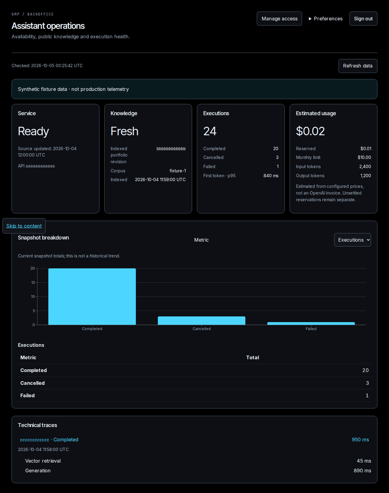
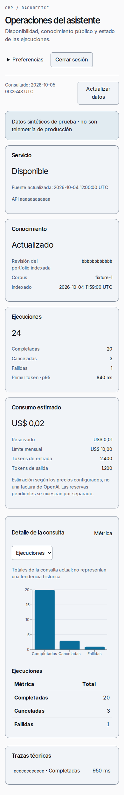

# Backoffice verification

Local environment: WSL Linux, Node 24.21.0, TypeScript 7.0.2, Next.js 16.3.6,
PostgreSQL 17 and Playwright 1.63.0. Browsers ran against the production container,
not the development server. Operational data and OAuth providers are deterministic
fixtures; PostgreSQL and signed session admission are real.

- 64 current unit/contract/tooling tests passed; this count still includes historical
  conversation tests pending the native migration.
- Strict typing, lint, documentation links, public-file scan and four skill entries passed.
- Production image sha256:abc01af176d17ce509067ca1ba086b3849662dd0b2dd5a3a6459e4b6aae5c18e
  built successfully: 194,338,842 bytes uncompressed, runtime user node.
- The image executed IAM migration successfully with a read-only filesystem and dropped capabilities.
- 21 browser checks passed across Chromium, Firefox and WebKit in 1.2 minutes.
- Three operational-unavailability checks passed across those engines in 11.7 seconds.
- Later readiness-table and fixture-startup changes require final image revalidation.
- The managed local lifecycle was exercised against a newly created isolated database:
  migration, signed-session provisioning and readiness passed; SIGINT removed the private
  session artifact. Only that disposable database was dropped afterward.

The backoffice pipeline passed for revision `6874d1e88fc00008ee2d2a0828d1fdaae456fba0`
in [Actions run 37244209786](https://github.com/gonzalomartinperez/portfolio-assistant-backoffice/actions/runs/37244209786).
Measured job durations: static 25s, immutable image 53s, browser/authentication 129s,
required aggregator 4s. Static and image run independently; browser tests reuse that
image without rebuilding. This verifies the current job graph, not field performance.
Subsequent product changes require checks on their own head revision before merging.

Both screenshots show test fixtures, not implemented production telemetry. Keyboard
checks cover owner/viewer navigation, Escape dismissal and focus restoration. Automated
accessibility checks and desktop viewport emulation do not prove screen-reader or
physical-phone behavior. Real Google/GitHub registrations, production operations API,
effective Coolify/proxy headers, deployment and paid model behavior are unverified.

Dependency maintenance was verified separately in GitHub Actions run
[37241921635](https://github.com/gonzalomartinperez/portfolio-assistant-backoffice/actions/runs/37241921635).
Its complete pre-migration pipeline passed in approximately four minutes; this is not
a timing measurement for the new backoffice pipeline. Dependabot PRs26 and27 merged
through required checks into develop. No production deployment followed.
